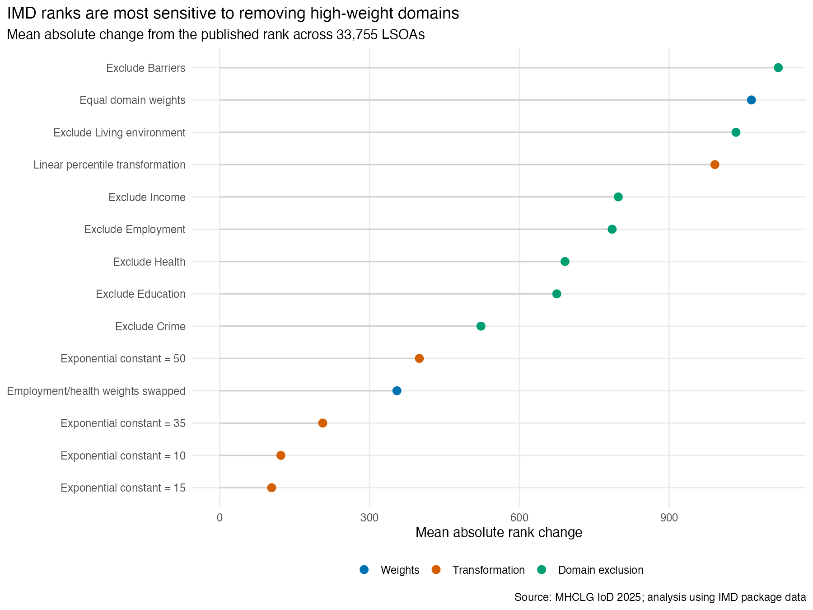
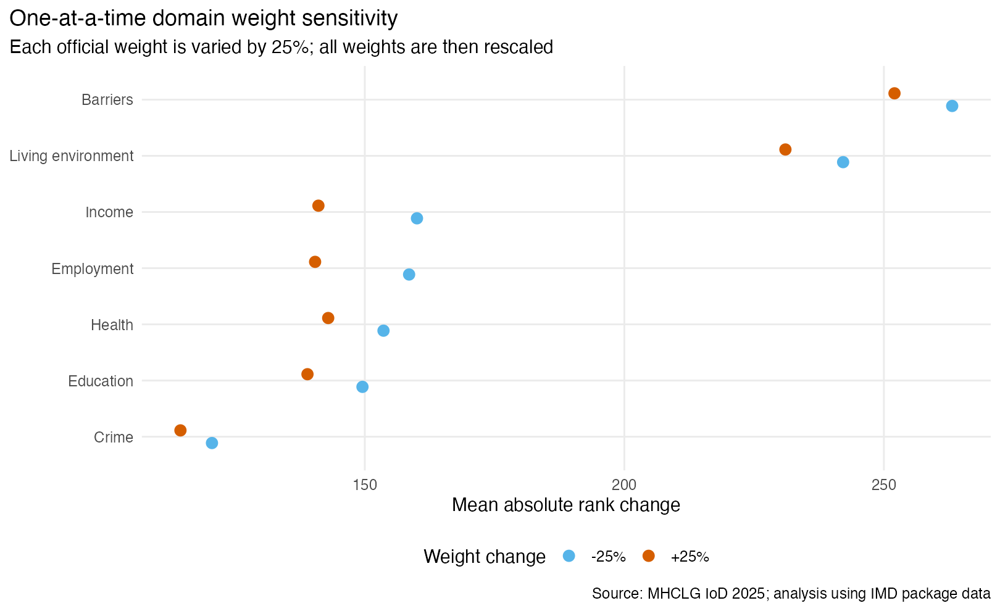
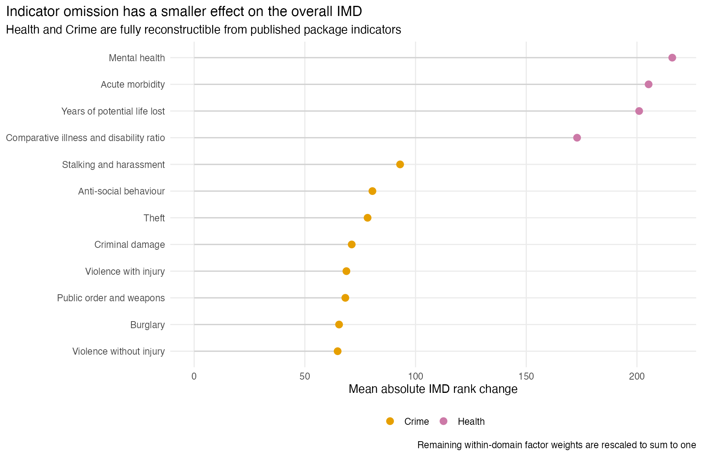
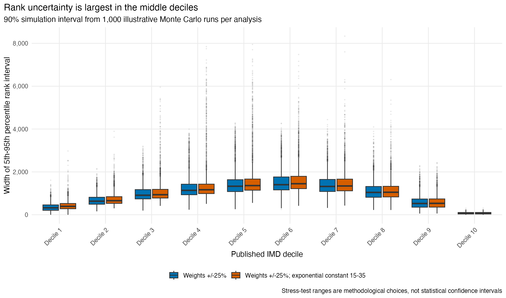
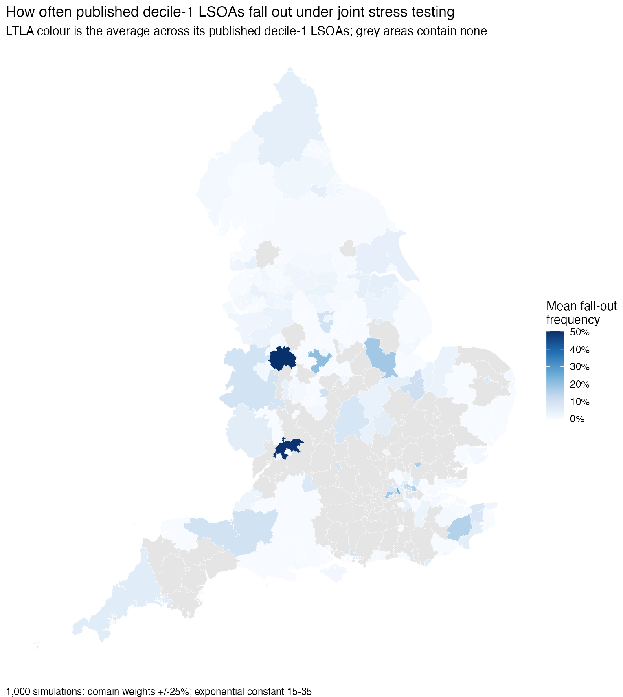

# Sensitivity analysis of the English Index of Multiple Deprivation 2025

## Executive summary

The published IMD 2025 is robust for identifying the most deprived neighbourhoods under the methodological alternatives tested, but individual ranks - especially in the middle of the distribution - should not be treated as precise point estimates.

Key findings:

- The official calculation was reproduced to near machine precision. The reconstructed and published ranks have Spearman correlation above 0.999999999; 90.4% match exactly and all differ by at most three rank places. The residual is explained by rounding in the published transformed-domain workbook.
- Giving all seven domains equal weight changes the average LSOA rank by 1,065 places. Even so, 92.4% of the published most-deprived decile and 93.9% of the published most-deprived quintile remain in those groups.
- Replacing the exponential transformation with linear percentiles changes the average rank by 991 places and retains 88.4% of the published most-deprived decile. This is the largest tested effect on the deprived tail.
- The technical report's empirically considered alternative - swapping the Employment and Health weights - has a modest effect: mean absolute movement of 355 ranks, 89.7% exact-decile agreement, and 97.6% retention of the most-deprived quintile.
- In one-at-a-time +/-25% weight tests, every LSOA remains within one decile of its published classification. Barriers to Housing and Services has the largest effect despite its 9.3% nominal weight, followed by Living Environment. These domains carry distinct information: their Spearman correlations with the published IMD score are only 0.245 and 0.341 respectively.
- In 1,000 simulations with all domain weights independently varied by +/-25%, the mean probability of staying in the same decile is 92.4%. Retention probabilities are 98.2% for the published most-deprived decile and 98.6% for the published most-deprived quintile.
- A broader 1,000-run stress test combining +/-25% weight variation with an exponential constant ranging from 15 to 35 gives similar results: 91.9% mean same-decile probability, 97.9% most-deprived-decile retention, and 98.5% most-deprived-quintile retention.
- Rank uncertainty is largest in the middle. Under the joint stress test, the median 90% rank interval is 374 places in decile 1, 1,451 places in decile 6, and 439 places in decile 10.

The practical conclusion is to use deprivation groups or deciles, especially at the deprived tail, rather than attach substantive meaning to small differences in exact rank.



## Data and reconstruction

The analysis uses:

- `IMD::imd2025_england_lsoa21_indicators` for the published underlying indicators;
- `IMD::imd2025_england_lsoa21` for official domain scores, IMD scores, ranks and deciles; and
- MHCLG's File 9 for the seven published exponentially transformed domain scores.

There are 33,755 2021 LSOAs. The official domain weights are Income 22.5%, Employment 22.5%, Education 13.5%, Health 13.5%, Crime 9.3%, Barriers 9.3%, and Living Environment 9.3%.

Following the [IMD 2025 Technical Report](https://assets.publishing.service.gov.uk/media/68ff59c80f801e57b5bef907/ID_2025_Technical_Report.pdf), a domain's fractional rank `R` is transformed as:

`X = -c * ln(1 - R * (1 - exp(-100 / c)))`

where the official scaling constant `c` is 23. The transformed domains are then combined by weighted arithmetic addition. The transformation intentionally limits cancellation between domains and gives more resolution to the deprived tail.

The published percentages sum to 99.9% because three weights are shown to one decimal place. Applying those published weights directly reproduces the published IMD score to a maximum absolute difference of 0.000826.

All official source workbooks are listed on the [MHCLG English indices of deprivation 2025 page](https://www.gov.uk/government/statistics/english-indices-of-deprivation-2025).

## Sensitivity design

The analysis distinguishes deterministic sensitivity scenarios from illustrative Monte Carlo uncertainty analysis.

Deterministic scenarios:

1. Equal domain weights.
2. Employment and Health weights swapped, matching the empirical alternative discussed in Appendix F of the technical report.
3. Linear domain percentiles in place of exponential transformation.
4. Exponential constants of 10, 15, 35 and 50 instead of 23.
5. Leave-one-domain-out calculations, with remaining weights rescaled.
6. Each domain weight changed by -25% and +25%, one at a time, with all weights rescaled.
7. Leave-one-indicator-out reconstruction for Health and Crime, with remaining factor weights rescaled.

Monte Carlo stress tests:

- Weight uncertainty: each weight receives independent uniform noise of +/-25% of its official value and all weights are rescaled to sum to one.
- Joint uncertainty: the same weight variation plus a transformation constant sampled uniformly from 15 to 35.
- Each analysis uses 1,000 simulations with seed `20250705`.

The +/-25% convention follows the weight-noise approach described in [COINr's sensitivity-analysis guidance](https://bluefoxr.github.io/COINrDoc/sensitivity-analysis.html). The exact IMD transformations were implemented directly rather than through a generic composite-indicator object so the official algorithm remains explicit and auditable.

These simulation ranges are analyst-defined stress tests, not confidence intervals for the official index.

## Results

### Structured methodological alternatives

| Scenario | Mean absolute rank change | Exact decile agreement | Most-deprived 10% retained | Most-deprived 20% retained |
|---|---:|---:|---:|---:|
| Equal domain weights | 1,065 | 69.9% | 92.4% | 93.9% |
| Employment/Health weights swapped | 355 | 89.7% | 97.1% | 97.6% |
| Linear percentile transformation | 991 | 73.8% | 88.4% | 95.1% |
| Exponential constant 15 | 104 | 97.0% | 98.8% | 99.4% |
| Exponential constant 35 | 206 | 94.1% | 98.1% | 99.1% |
| Exclude Income | 798 | 76.6% | 92.3% | 95.0% |
| Exclude Employment | 786 | 77.1% | 93.1% | 95.1% |
| Exclude Barriers | 1,118 | 69.2% | 95.2% | 95.4% |
| Exclude Living Environment | 1,034 | 71.4% | 94.6% | 95.5% |

Alternative weights and transformations move exact ranks materially, but the most-deprived groups are much more stable than the all-LSOA rank-change averages suggest. The linear-percentile case is the main exception: removing the official tail emphasis reduces most-deprived-decile retention to 88.4%, which confirms that the transformation is substantively important for targeting the most deprived areas.

### Domain weights



Changing a single domain weight by +/-25% produces mean absolute movements between 114 and 263 ranks. All LSOAs remain within one decile of their official classification in every one-at-a-time test.

Barriers and Living Environment produce the largest changes because they are weakly correlated with the domains that dominate the IMD. Nominal weights therefore do not equal effective importance: a relatively small but distinctive domain can alter rankings more than a larger, highly redundant domain.

### Indicator omission

Health and Crime can be reconstructed almost exactly from the package's published indicator fields: reconstructed-versus-official rank correlations are 0.9999999 and 0.9999917 respectively.



For Health, omitting one indicator changes the mean IMD rank by 173 to 216 places. Mental health has the largest impact. For Crime, the range is 65 to 93 places; stalking and harassment has the largest impact. The most-deprived-quintile retention remains at least 98.4% for every Health omission and at least 99.4% for every Crime omission.

This is a structural importance check, not a recommendation to remove indicators. Omitting an indicator changes the construct being measured as well as its statistical weighting.

### Monte Carlo rank uncertainty



| Analysis | Median 90% rank-interval width | Mean same-decile probability | LSOAs with >=80% same-decile probability | Top 10% retention | Top 20% retention |
|---|---:|---:|---:|---:|---:|
| Weights +/-25% | 969 | 92.4% | 83.6% | 98.2% | 98.6% |
| Weights +/-25%; constant 15-35 | 1,005 | 91.9% | 82.3% | 97.9% | 98.5% |

The middle ranks move most because many LSOAs have similar overall scores there and because the official exponential transformation intentionally concentrates resolution at the deprived end. A wide rank interval does not necessarily imply a large change in substantive deprivation; it can reflect many near-tied areas exchanging positions.

### Fall-out from the published most-deprived decile

For each LSOA in the published most-deprived decile, fall-out frequency is the proportion of simulations in which its recalculated rank is greater than 3,375. The table reports the 15 highest frequencies under the broader joint stress test.

| LSOA | Local authority | Published rank | Weight-only fall-out | Joint-test fall-out |
|---|---|---:|---:|---:|
| Northumberland 020C | Northumberland | 3,362 | 48.2% | 60.7% |
| Sheffield 025B | Sheffield | 3,373 | 52.4% | 58.8% |
| Sedgemoor 009B | Somerset | 3,374 | 52.0% | 58.1% |
| Hackney 003D | Hackney | 3,343 | 48.7% | 57.6% |
| Hackney 028C | Hackney | 3,344 | 48.4% | 57.5% |
| North Lincolnshire 016C | North Lincolnshire | 3,356 | 47.6% | 57.3% |
| Preston 009A | Preston | 3,370 | 49.5% | 56.4% |
| Knowsley 011D | Knowsley | 3,355 | 47.8% | 56.3% |
| Darlington 016A | Darlington | 3,367 | 48.5% | 54.5% |
| Fenland 002D | Fenland | 3,318 | 44.9% | 54.5% |
| South Kesteven 003D | South Kesteven | 3,360 | 50.5% | 53.7% |
| Tower Hamlets 017A | Tower Hamlets | 3,313 | 42.9% | 53.6% |
| Tower Hamlets 022C | Tower Hamlets | 3,364 | 52.9% | 52.1% |
| Newham 005C | Newham | 3,327 | 46.0% | 51.5% |
| East Riding of Yorkshire 003E | East Riding of Yorkshire | 3,346 | 45.7% | 50.8% |

The full table contains all 3,375 published decile-1 LSOAs, including the simulation counts and frequencies for both tests, in `output/tables/decile1_lsoa_fallout_frequency.csv`.



For national legibility, the map aggregates LSOA fall-out frequencies to 2024 lower-tier local authorities. Each area's colour is the mean joint-test fall-out frequency among its published decile-1 LSOAs; grey areas contain no such LSOAs. Local-authority averages based on only one or two decile-1 LSOAs should be read alongside the count in `output/tables/decile1_fallout_frequency_by_ltla.csv`.

## Scope and limitations

- This is sensitivity to index-construction choices, not uncertainty in the administrative source data, shrinkage estimates, denominators, geocoding, or temporal coverage.
- The Monte Carlo ranges are transparent stress-test assumptions. They are not probability statements about the correctness of the official weights or transformation.
- The requested package object has 28 indicator columns plus the LSOA code. Five contain some missing values, and the current object contains no Living Environment indicator fields. Several underlying components are also not published by MHCLG. A complete indicator-level reconstruction of every domain is therefore not possible from this object alone.
- For that reason, the national seven-domain analysis uses official published transformed domain scores, while indicator omission is restricted to Health and Crime, which are fully reconstructible from the package object.
- Results concern relative ranks within England. They do not measure uncertainty in absolute deprivation levels and should not be interpreted causally.
- Any threshold classification is mechanically most sensitive for LSOAs close to the threshold. Users making high-stakes allocation decisions should examine the supplied LSOA-level probabilities and rank intervals rather than rely only on a single cut-off.

## Reproducibility and outputs

Run from the analysis directory:

```sh
remotes::install_github("humaniverse/IMD")
IMD_SIMS=1000 Rscript imd2025-sensitivity.R
```

The script downloads MHCLG File 9 if it is absent, uses a fixed seed, and writes:

- `output/tables/scenario_summary.csv`: deterministic scenario metrics;
- `output/tables/weight_one_at_a_time.csv`: domain-weight perturbations;
- `output/tables/indicator_leave_one_out.csv`: Health and Crime omission checks;
- `output/tables/lsoa_rank_uncertainty.csv`: LSOA-level rank intervals and classification probabilities;
- `output/tables/most_rank_uncertain_lsoas.csv`: the 100 widest joint-stress-test intervals;
- `output/tables/decile1_lsoa_fallout_frequency.csv`: fall-out counts and frequencies for every published decile-1 LSOA;
- `output/tables/decile1_fallout_frequency_by_ltla.csv`: local-authority map data and decile-1 LSOA counts;
- `output/tables/monte_carlo_summary.csv`: national uncertainty summary; and
- five presentation-ready figures under `output/figures/`.

The complete implementation is in `imd2025-sensitivity.R`.
